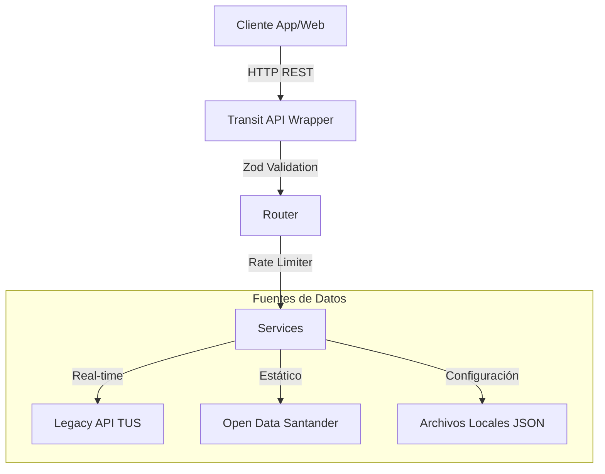

<div align="center">
  <h1>🚌 SANTANDER TUS API</h1>
  <p><strong>La API más moderna, rápida y unificada para el Transporte Urbano de Santander.</strong></p>
  <p>
    
    
    
    
    
  </p>
</div>

<br />

Una API REST diseñada con enfoque **DX-First** (Developer Experience). Envuelve múltiples fuentes de datos inconexas (Open Data estático, la API Legacy en tiempo real y configuraciones en memoria) ofreciendo una capa única con **37 endpoints** fuertemente tipados, documentados y consistentes.

---

## ✨ Características Principales

- 📚 **Documentación Premium**: Potenciada por **Scalar** y OpenAPI 3.1. Ofrece cliente REST integrado, dark mode nativo y snippets de código.
- 🛡️ **Validación Estricta**: Cada endpoint utiliza esquemas **Zod** para validar parámetros, purgar datos basura y devolver errores descriptivos.
- 🚦 **Rate Limiting Global**: Protección nativa contra abusos (500 reqs/5min) con límites ajustados para el planificador de viajes intermodal.
- ⚡ **Rendimiento Inigualable**: Caché agresiva en memoria para topología estática y balanceo dinámico hacia la API Legacy para datos en tiempo real.
- 🗺️ **Formatos Estándar**: Soporte nativo para GeoJSON en rutas y polilíneas para integrar mapas sin fricción en el frontend.

---

## 🏗️ Arquitectura del Sistema



### Fuentes de Datos Orquestadas
| Fuente | Función en la API |
|--------|------------------|
| **Open Data Santander** | 462 paradas indexadas, posiciones geográficas y catálogo de 15 líneas activas. |
| **Legacy API TUS** | Proveedor de estimaciones de llegada en tiempo real mediante telemetría GPS de los autobuses. |
| **Archivos Locales** | Almacenamiento rápido de *Horarios Programados* (~3200 entradas) y *Tarifas Oficiales*. |

---

## 📖 Documentación Interactiva (Scalar)

Una vez iniciado el servidor, dirígete a la joya de la corona: la referencia interactiva de la API.
```bash
http://localhost:3000/api/v1/docs
```
Aquí encontrarás los 37 endpoints categorizados, con ejemplos de JSON, tipos de retorno y la capacidad de hacer pruebas directamente en el navegador.

---

## 🚀 Uso de la API (Ejemplos Rápidos)

Nuestra jerarquía de URLs es puramente RESTful. En lugar de subrutas infinitas, usamos *query parameters* fuertemente tipados.

### 1. Llegadas en Tiempo Real
> Consulta cuándo llega el próximo autobús a la parada 41 (Ayuntamiento).
```bash
curl "http://localhost:3000/api/v1/stops/41/arrivals"
```
> Consulta *solo* la línea LC y limita el resultado al autobús más inminente.
```bash
curl "http://localhost:3000/api/v1/stops/41/arrivals?line=LC&limit=1"
```

### 2. Búsqueda y Geo-Filtros
> Encuentra paradas buscando por nombre (Fuzzy Search).
```bash
curl "http://localhost:3000/api/v1/stops?q=ayuntamiento"
```
> Encuentra paradas alrededor de una coordenada GPS (radio de 300m).
```bash
curl "http://localhost:3000/api/v1/stops/nearby?lat=43.4616&lng=-3.8055&radius=300"
```

### 3. Horarios Teóricos (Schedules)
> Consulta los horarios teóricos de la Línea Centro en dirección ida para un día laborable.
```bash
curl "http://localhost:3000/api/v1/lines/LC/schedules?day=weekday&direction=forward"
```

### 4. Rutas en GeoJSON (Para Mapas)
> Obtiene la línea 1 formateada directamente en GeoJSON para pintar en Leaflet o Mapbox.
```bash
curl "http://localhost:3000/api/v1/map/lines/1.geojson"
```

---

## 🚨 Manejo de Errores Estandarizado

Toda respuesta HTTP con estatus `4xx` o `5xx` devuelve un objeto JSON estructurado garantizado, procesado por nuestro **Global Error Handler**. 

**Ejemplo de una parada que no existe (HTTP 404):**
```json
{
  "success": false,
  "error": {
    "code": "STOP_NOT_FOUND",
    "message": "La parada 99999 no existe",
    "details": {
      "source": "open_data"
    }
  }
}
```

**Ejemplo de parámetro erróneo atrapado por Zod (HTTP 400):**
```json
{
  "success": false,
  "error": {
    "code": "VALIDATION_ERROR",
    "message": "Validation failed",
    "details": [
      {
        "code": "invalid_type",
        "expected": "number",
        "received": "nan",
        "path": ["lat"],
        "message": "Expected number, received nan"
      }
    ]
  }
}
```

---

## 🛠️ Desarrollo e Instalación

### Requisitos Mínimos
- **Node.js** ≥ 18
- **NPM** o **Yarn**

### Instalación

```bash
git clone https://github.com/ebroelevado/transit-api-wrapper.git
cd transit-api-wrapper
npm install
```

### Scripts Disponibles

```bash
# Iniciar en modo desarrollo con Hot Reload (tsx)
npm run dev

# Ejecutar el Test Suite (Vitest)
npm test

# Compilar para producción (TypeScript a dist/)
npm run build

# Arrancar la versión compilada
npm start
```

---

## 🗂️ Estructura del Proyecto

El código está desacoplado siguiendo buenas prácticas de separación de responsabilidades:
```text
src/
├── controllers/          # Lógica HTTP (pasa req/res a servicios)
├── docs/                 # Definiciones YAML para Scalar (OpenAPI 3.1)
├── middleware/           # Rate limiting, errorHandler, validate (Zod)
├── routes/               # Enrutadores de Express aislados por recurso
├── schemas/              # Esquemas de Zod (api.schemas.ts)
├── services/             # Lógica de negocio (OpenData, Trips, etc.)
├── sources/              # Adaptadores de red (Legacy TUS, MemCache)
├── utils/                # Utilidades puras (ApiError, Logger, Haversine)
├── index.ts              # Entrypoint de Express
└── swagger.ts            # Configuración OpenAPI
```
